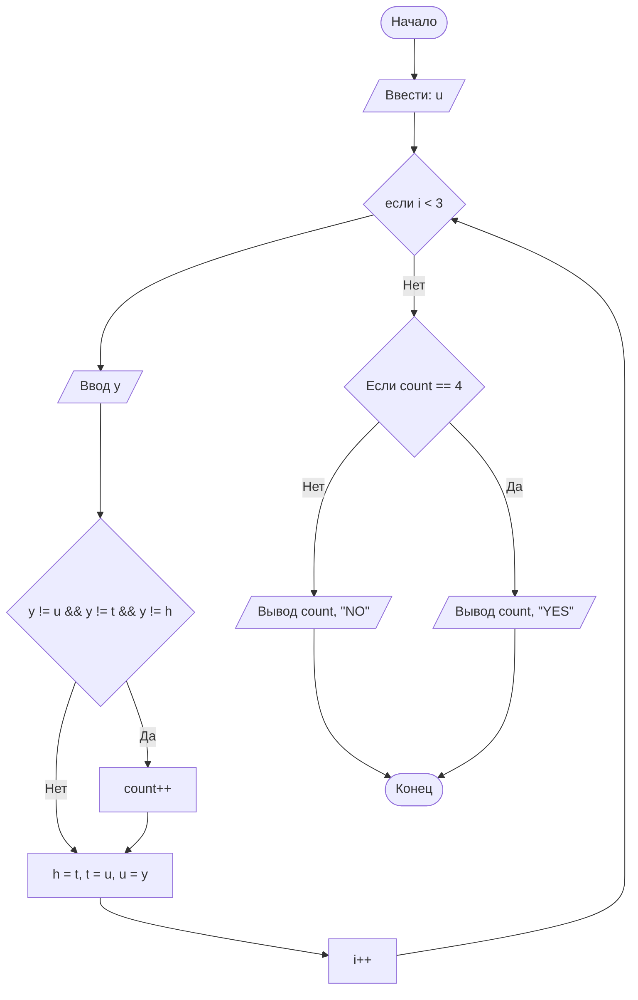

## Отчет по лабораторной работе № 1

#### № группы: `ПМ-2402`

#### Выполнил: `Забирохин Всеволод Сергеевич`

#### Вариант: `9`

### Cодержание:

- [Постановка задачи](#1-постановка-задачи)
- [Входные и выходные данные](#2-входные-и-выходные-данные)
- [Выбор структуры данных](#3-выбор-структуры-данных)
- [Алгоритм](#4-алгоритм)
- [Программа](#5-программа)
- [Анализ правильности решения](#6-анализ-правильности-решения)

### 1. Постановка задачи
Условие задачи:
> Четыре квадрата с длинами сторон A, B, C и D пытаются расположить друг над другом, начиная с самого большого. Можно ли разместить все квадраты так, чтобы каждый следующий был строго меньше предыдуще- го? Вывести количество квадратов, которые удастся разместить в таком порядке. На вход программы подаются натуральные числа A, B, C, D.


Данную задачу я понимаю следующим образом:

- Необходимо ввести сторону первого квадрата в переменную
- С вводом последующих сторон в цикле, необходимо проверить, не равны ли они предыдущим:
   1. Если переменная не равна ни одной предыдущей `count ++`
   2. В ином случае оставляем `count` равным предыдущему значению
- После окончания цикла, необходимо проверить, можем ли мы расположить квадраты по убыванию:
   1. Если условие `if (count == 4)` выполняется, выводим `YES`
   2. В противном случае выводим `NO`

### 2. Входные и выходные данные

#### Данные на вход

На вход программа должна получать 4 натуральных числа, так как натуральные числа включаются в множество целых чисел, то был выбран тип данных `int`.

#### Данные на выход

Программа должна вывести 2 значения:
   1. Количество квадратов, которых можно разместить указанным в условии способом, используя при этом тип данных `int`
   2. Ответ на вопрос о возможности расположения таким способом всех 4-х квадратов, используя тип данных `string`

### 3. Выбор структуры данных

Программа получает 4 натуральных числа по условию. Поэтому для их хранения
можно выделить 4 переменные (`y`, `h`, `t`, `u`) типа `int`. Также используется переменная `count`, которая обозначает счётчик, типа `int`

### 4. Алгоритм

#### Алгоритм выполнения программы:

1. **Ввод данных:**  
   Программа считывает одно целое число, обозначенное как `u` вне цикла и 3 целых числа в цикле `for`, обозначенных `y`.


2. **Сравнение чисел:**  
   1) Программа сравнивает значение каждого нового `y` со значениями `u`, `t`, `h`. Если `y` не равно значениям сторон остальных квадратов, программа увеличивает значение счётчика `count` на 1 и сдвигает переменные
   
   2) Если же числа не прошли условие, то `count` остается на предыдущем значении, значения сторон квадрата сдвигаются
   

3. **Проверка на соответствие условию о том, что можно разместить в порядке убывания все 4 квадрата, и вывод результата:**
   
   - Если происходит соответствие условию (`if (count == 4)`), программа выводит значение переменной `count` и положительный ответ на вопрос задачи `YES`
   - Иначе выводим на экран значение счётчика `count` и отрицательный ответ на вопрос задачи `NO`

#### Блок-схема



### 5. Программа

```java
import java.io.PrintStream;
import java.util.Scanner;
public class Main2 {
   public static Scanner in = new Scanner(System.in);
   public static PrintStream out = System.out;
   public static void main(String[] args) {
      int u = in.nextInt(); // ввод стороны квадрата А
      int count = 1; // переменная счётчика наложенных друг на друга квадратов
      int t = 0; // переменная для того, чтобы было возможно сдвинуть значения сторон квадратов, тем самым запомнив их
      int h = 0; // переменная для того, чтобы было возможно сдвинуть значения сторон квадратов, тем самым запомнив их
      for(int i = 0; i<3; i++) { // создаем цикл, в котором вводим стороны оставшихся 3-х квадратов (цикл выполняется 3 раза)
         int y = in.nextInt(); // ввод значений сторон новых квадратов
         if ((y != u) && (y != t) && (y != h)) { // проверка условия (если новая сторона != ни одной старой, тогда она нам подходит)
            count += 1;
         }
         h = t; // сдвигаем значения переменных, чтобы осуществлялась полная проверка условия
         t = u; // сдвигаем значения переменных, чтобы осуществлялась полная проверка условия
         u = y; // сдвигаем значения переменных, чтобы осуществлялась полная проверка условия

      }
      if (count == 4) { // когда счётчик равен 4, тогда и только тогда мы можем расположить все 4 квадрата в порядке убывания, следовательно, мы можем положительно ответить на вопрос задачи
         out.println(count + " - YES");
      }
      else { // если же счётчик меньше 4, то мы не можем распределить все квадраты указанным в условии способом, следовательно отвечаем на вопрос задачи отрицательно
         out.println(count + " - NO");
      }
   }
}
```

### 6. Анализ правильности решения

Программа работает корректно на всем множестве решений с учетом ограничений.

1. Тест на 4-х разных по длине сторонах квадратов:

    - **Input**:
        ```
        1 2 3 4
        ```

    - **Output**:
        ```
        4 - YES
        ```

2. Тест на 3-х совпадающих сторанах квадратов:

    - **Input**:
        ```
        1 1 2 1
        ```

    - **Output**:
        ```
        2 - NO
        ```

3. Тест на 2-х совпадающих и 2-х несовпадающих сторонах квадратов:

    - **Input**:
        ```
        2 3 2 1
        ```

    - **Output**:
        ```
        3 - NO
        ```

4. Тест на 2 - х попарно совпадающих сторонах квадратов:

    - **Input**:
        ```
        2 1 1 2
        ```

    - **Output**:
        ```
        2 - NO
        ```

5. Тест на 4-х совпадающих сторонах квадратов:

    - **Input**:
        ```
         13 13 13 13
        ```

    - **Output**:
        ```
        1 - NO
        ```
